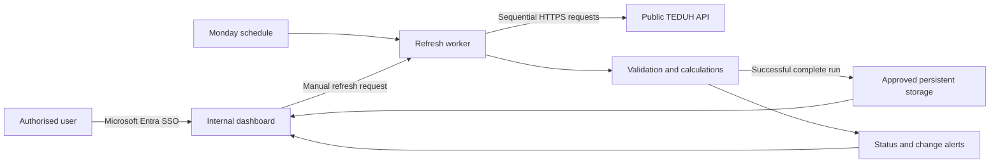

# TEDUH Project Monitoring Platform

## Concise pitch for Real Estate leadership and Modernisation

**Proposed by:** Lim Ri Jun  
**Current status:** Working proof of concept using public TEDUH data; not production-ready  

---

## The one-minute pitch

> Our Real Estate team repeatedly searches TEDUH project by project to update sales, construction and project status for monthly monitoring and annual credit reviews. I built a working proof of concept that saves selected projects, collects the same public TEDUH information, retains dated observations and highlights Sakit or Lewat projects.
>
> It does not replace SIBS, LEAP, RM Workbench, our credit process or RM judgement. It contains no customer balances, facility information or credit decisions. I am proposing a small, controlled pilot so we can measure the time saved and ask Modernisation to determine the appropriate internal hosting, security and support model.

## The problem

- TEDUH has no saved shortlist tailored to our portfolio and comparator projects.
- RMs repeatedly locate the same projects and transcribe the same public information.
- The work is repeated monthly and again when annual credit papers are prepared.
- Manual collection makes consistency, historical comparison and early identification of status changes more difficult.
- Time is spent gathering public facts instead of analysing the customer and transaction.

## What the prototype already demonstrates

- Uses TEDUH's public JSON API rather than scraping webpage HTML.
- Tracks selected projects across Kuala Lumpur, Penang, Selangor, Johor and Malacca.
- Separates projects into Reporting Set, Comparator Set and General.
- Preserves local display names and parent-group mappings separately from TEDUH facts.
- Shows units sold, sales percentage, construction percentage and TEDUH status.
- Highlights Sakit and Lewat projects.
- Shows CCC/CFO evidence, First SPA, SPA price ranges and source dates where available.
- Retains dated observations for weekly movements.
- Supports controlled manual refresh and on-demand Discovery.
- Records project additions and field-level manual edits in an audit log.
- Preserves the previous valid snapshot when a retrieval fails validation.

The prototype deliberately excludes customer names, facility amounts, outstanding balances, internal ratings, credit decisions and proprietary competitor analysis.

## What this tool is—and is not

This is a **public-data monitoring and decision-support tool**.

It is not:

- A replacement for SIBS customer and transactional information
- A replacement for LEAP financing, obligor or credit records
- A replacement for RM Workbench portfolio and activity functions
- A new credit-risk rating or source of record
- Evidence by itself that a borrower or facility is impaired

A TEDUH status is a public HIMS project classification. It must not be interpreted independently as the bank's customer, facility or credit-risk status.

## Where it could sit

The pilot does not need to be built inside an existing core system.

```text
RM Workbench / internal app launcher / Teams
                    ↓ link
Standalone Real Estate Project Monitor
                    ↓
Public TEDUH data + approved internal storage
```

- **SIBS:** Not an appropriate home for a public-data monitoring utility.
- **LEAP:** Possible future reference point, but direct integration would unnecessarily enlarge the pilot.
- **RM Workbench:** The most logical potential place for a link or tile because it serves RMs and portfolio monitoring.
- **Standalone internal application:** The simplest and safest pilot arrangement.

Modernisation should decide the approved hosting platform and whether the application is later linked from an existing portal.

## How an internal version could work

Microsoft 365 suggests that Microsoft Entra ID is likely available for organisational SSO, but Modernisation must confirm the company's approved hosting standards.



A reasonable Azure reference design would use:

- Azure Container Apps, App Service or another approved platform for the dashboard
- Microsoft Entra ID for SSO and role-based access
- Azure Functions or an approved scheduler for the Monday refresh
- Azure SQL or another approved database for persistent history and audit records
- Blob Storage or an approved repository for dated raw TEDUH responses
- Managed Identity and Key Vault so passwords are not stored in code
- Azure Monitor/Application Insights for operational failures and performance

This is a reference design for Modernisation to validate—not a requirement to use specific Azure products. The underlying data pipeline should remain reusable if the final interface is Power BI, Power Apps or another internal portal.

## The automated Monday refresh

No AI is required.

1. Read the active project codes.
2. Request each project sequentially from the public TEDUH API.
3. Retry temporary failures conservatively.
4. Store the retrieval time and TEDUH displayed data-through date separately.
5. Validate JSON structure, project codes, required fields, dates, prices, units and construction information.
6. Calculate sales, construction and value measures using deterministic rules.
7. Stage the complete weekly result.
8. Publish only when the required validation succeeds.
9. Preserve the previous valid snapshot if TEDUH is unavailable or malformed.
10. Append the successful observation and generate Sakit, Lewat and change alerts.

The dashboard does not need to be open. A manual refresh would invoke the same controlled process, prevent overlapping jobs and record who requested it.

AI could eventually draft an optional narrative from validated figures, but it should never retrieve or calculate the core data.

## Security and access position

- Use Microsoft Entra SSO rather than a shared password.
- Limit the pilot to selected Real Estate RMs and agreed stakeholders.
- Use Viewer, Editor and Administrator roles.
- Use the authenticated identity for audit attribution.
- Do not provide automatic bank-wide access or alerts.
- Keep customer, facility and credit information in existing approved systems.
- Remove free-text notes from the pilot unless Data Governance explicitly approves them.
- Agree data retention, outbound TEDUH access and support ownership before production.

This is appropriate need-to-know access—not an attempt to conceal public project statuses.

## Addressing likely RM concerns

### “Will this become a management surveillance dashboard?”

The pilot should be positioned as an RM working tool for early warning and preparation. Broader access must be agreed rather than assumed. It should not rank RMs or infer bank credit status from TEDUH.

### “Will Credit or management question every Sakit project?”

They may ask questions about public information regardless of this tool. The benefit is that the RM sees the status early and can investigate before a monthly review. Formal customer or facility context belongs in LEAP or the appropriate credit process, not in this dashboard.

### “Can an RM change or hide the TEDUH status?”

No. Source facts should remain uneditable. An RM may mark an alert as reviewed, but must not overwrite the public source status.

### “Does Sakit mean our financing is impaired?”

No. TEDUH project status and bank credit status are separate. The application must carry that disclaimer prominently.

## Proposed pilot

### Scope

- Two or three Real Estate RMs
- A selected number of Reporting Set projects and comparators
- A controlled selection from the supported Malaysian regions
- Two monthly monitoring cycles
- Weekly automated refresh plus controlled manual refresh
- No customer or financing information

### Success measures

- Baseline and measure time spent before and during the pilot.
- Confirm sampled dashboard fields against public TEDUH.
- Confirm that no Sakit or Lewat pilot project is missed.
- Demonstrate that source failure preserves the previous valid snapshot.
- Confirm complete audit attribution for manual project changes.
- Gather RM and Credit feedback on usefulness and unintended consequences.
- Confirm that no customer-confidential or financing data is stored.

## The request

I am asking for:

1. A Real Estate management sponsor for a controlled pilot.
2. Modernisation guidance on the approved hosting, identity and data platform.
3. Information Security/Data Governance review of scope and access.
4. Two or three pilot users and two reporting cycles.
5. Agreement that I remain involved as business product owner or pilot lead.

### Proposed responsibilities for Lim Ri Jun

- Define and prioritise the RM requirements.
- Coordinate user testing and TEDUH source reconciliation.
- Measure time saved and adoption.
- Keep the scope outside customer and financing data.
- Work with Modernisation on the production backlog and rollout decision.

## Five-minute speaking plan

### 0:00–1:00 — problem

Explain the repeated monthly and annual manual TEDUH searches.

### 1:00–3:00 — demonstration

Show:

1. Region selection and tracked-project count
2. Projects needing attention
3. One project's sales, construction, status and data dates
4. Shortlist/project sets
5. Audit log

### 3:00–4:00 — boundaries and controls

Explain that it uses public TEDUH data, does not replace core systems, contains no customer financing information and preserves the last valid output on failure.

### 4:00–5:00 — pilot and ask

Propose the limited pilot and ask Modernisation to validate the technical route while you remain the business pilot lead.

## Short technical Q&A

### Is it scraping?

No. The prototype requests structured JSON from TEDUH's public API. Modernisation or Legal should still confirm acceptable automated use and request limits.

### Can it refresh automatically?

Yes. A scheduled worker can run every Monday without the dashboard being open. Manual refresh uses the same process.

### What happens when TEDUH is down?

The system retries temporary failures, rejects incomplete results and retains the previous valid snapshot.

### Why not keep using CSV files?

CSV is sufficient for a local single-user prototype. A shared version needs persistent storage, concurrent-user safety, permissions and reliable audit records.

### Why not build it directly in Power BI?

Power BI may be the preferred final interface. The reusable assets are the validated TEDUH pipeline, data model, controls and business requirements.

### Is it production-ready?

No. It proves the workflow and technical feasibility. Production requires approved hosting, persistent storage, SSO, monitoring, deployment controls, governance and support ownership.

## Closing statement

> The prototype demonstrates that this manual monitoring problem is solvable without AI and without introducing customer banking data. I am asking for a controlled pilot to measure the value and determine the correct internal technology and governance route—not approval to place a home-built application directly into production.

## Microsoft technical references

- [Microsoft Entra identity infrastructure for Microsoft 365](https://learn.microsoft.com/en-us/microsoft-365/downloads/m365e-identity-infra.pdf?view=o365-worldwide)
- [Authentication in Azure Container Apps](https://learn.microsoft.com/en-us/azure/container-apps/authentication)
- [Scheduled tasks using Azure Functions](https://learn.microsoft.com/en-us/azure/azure-functions/scenario-scheduled-tasks)
- [Microsoft Entra authentication for Azure SQL](https://learn.microsoft.com/en-us/azure/azure-sql/database/authentication-aad-overview?view=azuresql)
- [Managed identities for Azure resources](https://learn.microsoft.com/en-us/entra/identity/managed-identities-azure-resources/overview-for-developers)
- [Azure Key Vault authentication](https://learn.microsoft.com/en-us/azure/key-vault/general/authentication)
